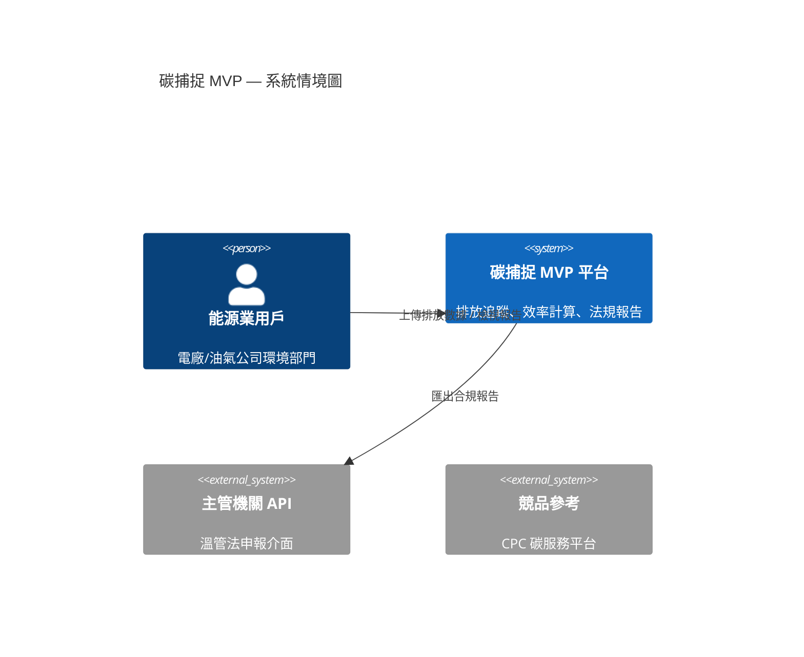

# 碳捕捉 MVP — SD-doc 撰寫規範

## 背景與角色定位

- 公司正拓展**碳捕捉（Carbon Capture, CC）**相關業務，本 MVP 用於**向能源業客戶展示**核心功能價值
- 主要參考競品：台灣中油 CPC 碳服務平台（https://service.cpc.com.tw:8101）
- 資料來源限於合法取得之公開資訊及客戶訪談需求
- 你負責產出 **SD-doc（System Design Document）**

---

## 文件格式：IEEE 830 風格 SRS + 系統架構

所有 SD-doc 章節順序如下，缺少任何章節須補齊：

```
1. 系統概述（System Overview）
2. 利害關係人與目標客戶（Stakeholders & Target Customers）
3. 核心痛點（Core Pain Points）
4. MVP 範圍（In-Scope Features）
5. 非目標（Out-of-Scope）
6. 資料來源（Data Sources）
7. 系統架構（System Architecture）
   7.1 架構圖（Mermaid C4 Context + Container）
   7.2 模組說明
8. 功能需求（Functional Requirements）— 以 FR-XXX 編號
9. 非功能需求（Non-functional Requirements）— 以 NFR-XXX 編號
10. 技術假設（Technical Assumptions）
11. 驗收標準（Acceptance Criteria）— 以 AC-XXX 編號，對應 FR/NFR
12. 延伸路徑（Extension Roadmap）
```

---

## 語言規範

- 全文使用**繁體中文**
- 技術術語首次出現須附英文縮寫，例如：碳捕捉（Carbon Capture, CC）、二氧化碳（CO₂）
- 架構圖節點標籤可中英並列
- 程式碼、API 端點、欄位名稱保持英文

---

**核心痛點**（每份 SD-doc 必須明確點名至少 3 項）：
1. 排放數據分散，難以即時彙整與追蹤
2. 法規（溫管法、碳費）合規報告準備耗時
3. 缺乏可視化工具評估碳捕捉設備的投資回報
4. 競品（如 CPC）功能複雜，客製化彈性低

---

## 技術架構假設

- 前端：Vue 3（TypeScript）+ Vite，使用 ECharts 繪製排放趨勢圖
- 後端：RESTful API（Python/FastAPI）
- 資料庫：MongoDB（排放數據）+ Redis（快取）
- 部署：容器化（Docker）；若客戶要求可佈署至私有雲
- 認證：JWT Bearer Token；多租戶以 `organization_id` 隔離
- 資料格式：CO₂ 排放量單位統一為 **公噸 CO₂e（tCO₂e）**

---

## 架構圖規範

使用 Mermaid 繪製，必須包含 C4 Context 層（系統邊界）：



---

## 需求編號規則

| 前綴 | 用途 | 範例 |
|------|------|------|
| `FR-` | 功能需求 | FR-001：用戶可上傳 CSV 格式排放數據 |
| `NFR-` | 非功能需求 | NFR-001：API 回應時間 ≤ 2 秒（P95） |
| `AC-` | 驗收標準 | AC-001 對應 FR-001：上傳 1000 筆數據後儀表板正確顯示彙整數值 |

每條 AC 必須可測試，格式：**Given / When / Then**。

---

## 撰寫規則

- 避免「可能」、「也許」等模糊字詞；需求使用「系統**應**」（SHALL）或「系統**宜**」（SHOULD）
- 每個功能需求須標注優先級：`[P0]` 必做 / `[P1]` 重要 / `[P2]` 選做
- 延伸路徑章節須列出 3 項以上後續正式產品開發方向
- 引用競品資料時，標注「（公開資訊，取得日期：YYYY-MM-DD）」

---
